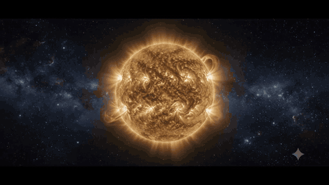

# Hi, I'm Mohammad Adeeb 👋

I build web experiences where motion carries the story — not just decoration bolted on top.

---

## 🌞 Featured project — AD Solar Company

**AD Solar Company** is a renewable-energy website built around a cinematic scroll animation: a 120-frame solar sequence — the sun in deep space, light travelling to Earth, panels filling the frame — plays as the background of the entire page, scrubbed frame-by-frame by your scroll position.

> ⚡ **Live site:** [anima-tales.lovable.app](https://anima-tales.lovable.app)

**What's under the hood**

- 120 hand-generated frames streamed from a CDN and preloaded before the animation starts
- A sticky `<canvas>` driven by scroll progress with `requestAnimationFrame`, so playback stays smooth at any scroll speed
- Glass-morphism content sections layered over the sequence, so the story reads behind real page content
- React 19 · TanStack Start · Tailwind CSS v4

---

  

